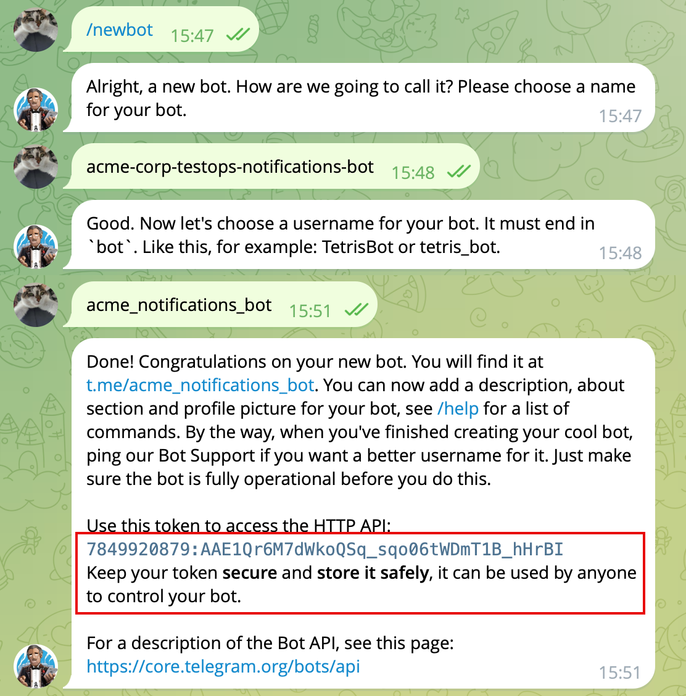

# March 2025

## Allure TestOps got notifications

News are [here](https://docs.qameta.io/allure-testops/release-notes/#03-march-2025--allure-testops-2511)

In the first quarter of 2025, a new feature called Web-hooks (it's actually outgoing web-hoks) has appeared in Allure TestOps thanks to the team effort. The feature is the first step of the implementation of the notifications functionality. At the moment, the following events have been supported. 

- events related to the creation or closing of launches.
- events related to defects, when you create, close or delete a defect.
- events related to test plans, when you create or delete a test plan.

This feature allows you to trigger web-hooks on the side of third-party applications like corporate messengers like Slack or send messages Telegram channels. Then yiour messenger show the event description. Simple like that.

You can say, Telegram has no web-hooks. Yes and no. You cannot trigger a web-hook directly, still you can create a simple stupid bot and use is for channeling your messages.

— Bot will be stupid? - Yes

— Do we need to code? - No.

— Lovely.

How? Let's get crackin'...

### Telegram bot creation

There are tons of gudes related to the creation of a telegram bot. 
Basically, the creation of a Telegram bot looks like 
1. Find `@BotFather`
2. Start the process
   1. `/newbot`

3. Get your bot name


Pass all the steps of the bot creation. You can also play with avatars and stuff, but we'll leave out this stuff here.

Important wthings to remember, the BotFather will provide you the bit ID and API key to control the bot activities over API. These are secrets! Don't show them to anyone (see below, by the time this article will see the light, the secrats shown below won't be actual anymore):



With the data provided by the BotFather we can start our journey.

We would need:

- Chat identifier (a bit tricky, still doable)
- the format of the API call (see above, the API docs link provided by BotFather)

### Simplest way

I'll receive the messages from Allure TestOps right into the direct chat between chat bot I created and me, you can add the bot as a member to a group chat and all chat members will receive the notifications.

1. Find the bot usig s find the book using search feature (you named it, so use its name).
2. Send a single message to the bot.

Then we need to open the APUI descriptoin and do some sophisticated stuff.

There is API method **getUpdates** and this is what we need.

We need to use the secrets provided by BotFather and buld the following string

```
https://api.telegram.org/bot7849920879:AAE1Qr6M7dWkoQSq_sqo06tWDmT1B_hHrBI/getUpdates
```

Open this in browser.

You will get something like this.

```
{
  "ok": true,
  "result": [
    {
      "update_id": 932371764,
      "message": {
        "message_id": 3,
        "from": {
          "id": 5023003345,
          "is_bot": false,
          "first_name": "QAQA",
          "last_name": "QA",
          "username": "qaqaqa",
          "language_code": "en"
        },
        "chat": {
          "id": 5023003345,
          "first_name": "QAQA",
          "last_name": "QA",
          "username": "qaqaqa",
          "type": "private"
        },
        "date": 1741270605,
        "text": "yeah"
      }
    }
  ]
}
```

There is chat ID information

```
       "chat": {
          "id": 5023003345,
          <some other stuff>
        },
 
```

Save it.

Then, let's go to Allure TestOps UI to a project settings and create an outgoing web-hook.

Create the following endpoint for the web-hook.

```
https://api.telegram.org/botbot7849920879:AAE1Qr6M7dWkoQSq_sqo06tWDmT1B_hHrBI/sendMessage
```


Then you can start creating the events and messages you send based on the events.


The yiou can add variables to provide a specific information for the user in the message's text.

The format of the message sent to the Telegram bot has the following format:

```
{
    "chat_id": "the ID of the Telegram Chat",
    "text": "text to be sent"
}
```

The chat ID we've got from **getUpdates** command.

The text to be sent is what you wan to see in the Telegram chat. You can add the references to Allure TestOps entities using this button.

So in the Event description we could provide something like this

```
{
    "chat_id": "5023003345",
    "text": "{{createdBy}} created {{launchName}} in project  {{projectName}}. Link: {{launchUrl}}"
}
```


Additionally you can add filters for launches (defects, test-plans) to avoid sending the messages for 100% of events.

And after you create a launch, you'll get the message in your p2p chat with the crated Telegram Bot.


