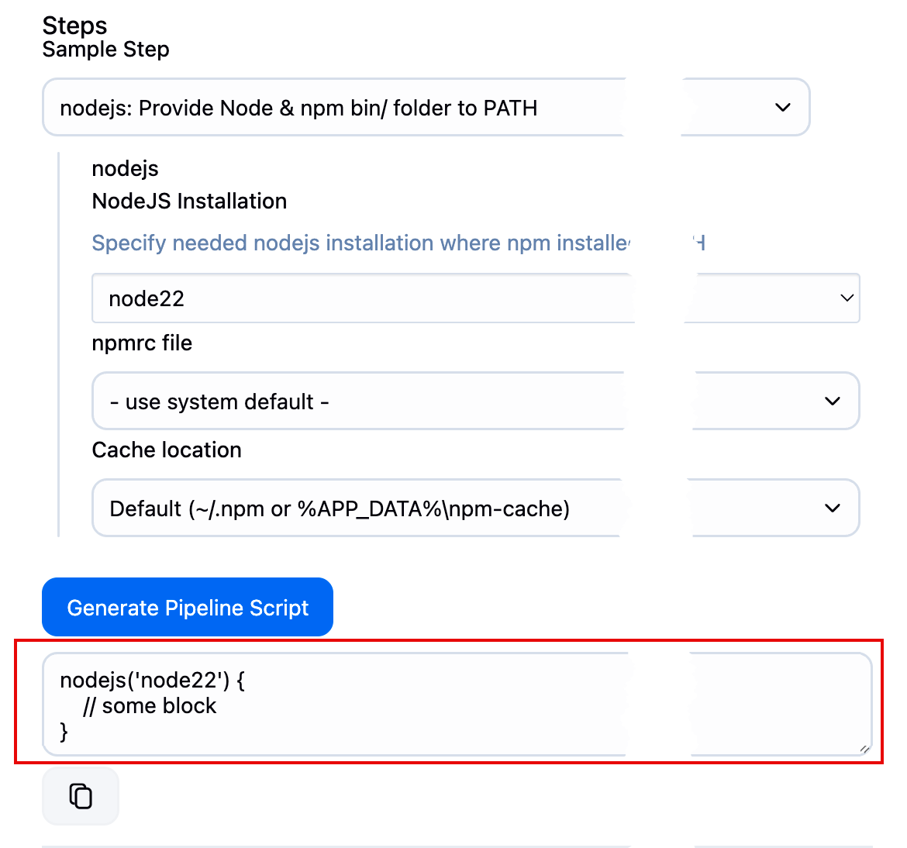
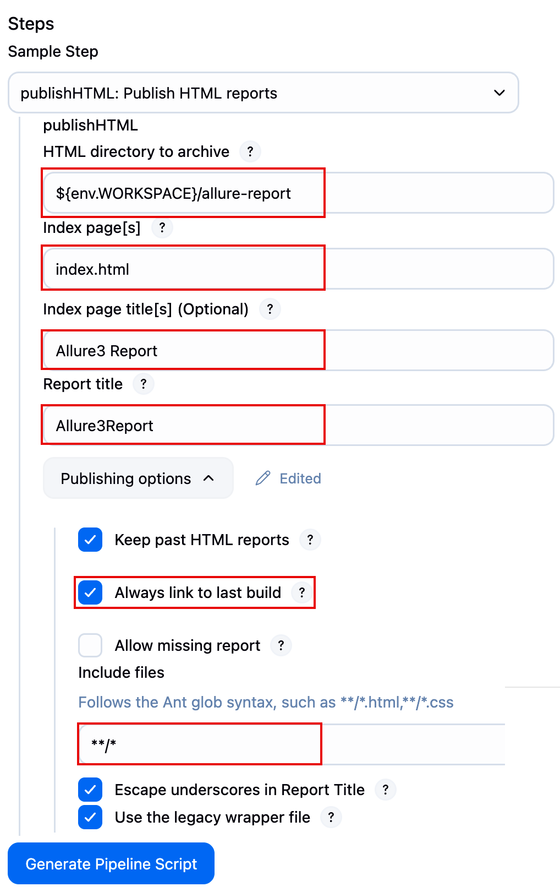
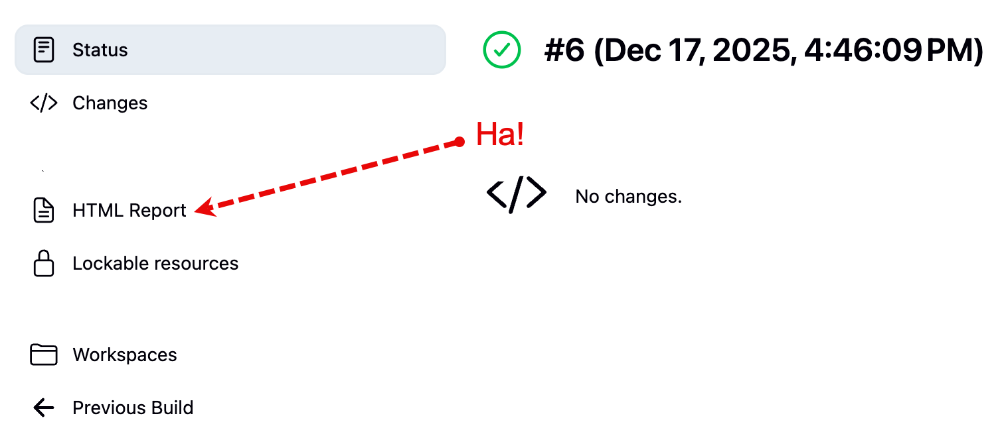
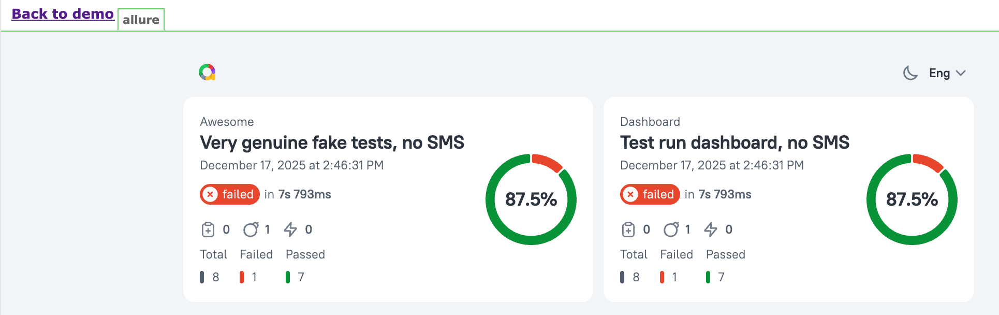

# Diciembre 2025

## 2025-12-14

Acabo de ver la película Mar adentro, cuenta la historia de un hombre que siempre quiso morir. Bueno, claro, no siempre, pero supongo que para una persona que a los veinte con tantos años perdió la capacidad de moverse, los siguientes 20 años serán ese "siempre" que recuerda.

Esta película es una cuestión sobre si una persona puede disponer de su vida como quiera, incluyendo temas como si debe seguir vivo o no, teniendo en cuenta que la vida es un derecho de cada persona, pero no su obligación.

Si una persona no quiere vivir, ¿tiene derecho la sociedad a negarle su deseo de morir, si lo que tiene no le trae ninguna alegría y lo único en lo que puede pensar es en la muerte? Al final muere, pero lo hace según sus palabras "como un criminal".

## 2025-12-18

### Allure 3 can be added as HTML report to Jenkins pipeline without dedicated plugin

::: info
T&C apply ;)
:::

#### What we need

1. Jenkins
2. Jenkins pipeline
3. Some tests
4. Some plug-ins.
   1. Install [HTML publisher](https://plugins.jenkins.io/htmlpublisher/)
   2. Install [NodeJs plug-in](https://plugins.jenkins.io/nodejs/), Allure3 will need it anyway.

#### Add node to your Jenkins

In the Jenkins configuration section go to Tools and find NodeJS (`/manage/configureTools/`).


I chose version 22 and haven't regretted it.

#### Setup pipeline for using node and running tests

1. Go to the pipeline
2. Click Pipeline syntax
   1. I surprised a lot of people don't know about this link.
   2. 
3. Fill the required data in the snippet generator and generate the snippet
   1. 
   2. put it to your pipeline
4. Add the commands to be executed for your tests execution preps and the execution itself.

```groovy
pipeline {
    agent any

    stages {
        stage('git pull') {
            steps {
                git branch: 'jenkins-html', url: 'https://github.com/cheshi-mantu/pw-allure-three-features.git'
            }
        }

        stage('run playwright tests via allure run') {
            steps {
                nodejs('node22') {
                sh 'npm i'
                sh 'npm install -g allure'
                sh 'npx allure run -- npm test'
            }
            }
        }
    }
}

```

#### Execute the pipeline

Execute the pipeline see if everything is working.

The line `sh 'npx allure run -- npm test'` will execute tests and (sic!) generate allure3 report, which by default or as per your config will be at the same level in `allure-report` folder.

`allure-report` folder has index.html file, and this is the file (and all the stuff related to it as well) we want to see as the result of the Jenkins pipeline execution.

You can check the structure of the folders of the current Pipeline workspace by going as follows:

1. Go to a build
2. Click Workspaces (lower left in the side menu)
3. Then in the center of the page you'll see summat like `/var/jenkins_home/workspace/tratata/demo-with-allure3 on built-in` link
4. Follow the link and you'll see the workspace folder structure.
5. Workspace path also resides in `${env.WORKSPACE}` environment variable (we'll use it below).

#### Adding the HTML report to the pipeline

We need the same code snipped generator, now we need it for [HTML publisher](https://plugins.jenkins.io/htmlpublisher/) 

1. Find Publish HTML reports in the list of actions
2. Fill summat like this
   1. 
3. Generate and put to your pipeline to get something like this.

```groovy
pipeline {
    agent any

    stages {
        stage('git pull') {
            steps {
                git branch: 'jenkins-html', url: 'https://github.com/cheshi-mantu/pw-allure-three-features.git'
            }
        }

        stage('run playwright tests via allure run') {
            steps {
                nodejs('node22') {
                sh 'npm i'
                sh 'npm install -g allure'
                sh 'npx allure run -- npm test'
            }
            }
        }
        stage('publish HTMl report') {
            steps {
                publishHTML([allowMissing: false, alwaysLinkToLastBuild: true, icon: '', keepAll: true, reportDir: "${env.WORKSPACE}/allure-report", reportFiles: 'index.html', reportName: 'Allure3Report', reportTitles: 'Allure3Report', useWrapperFileDirectly: false])
            }
        }
    }
}
```

And then after the next run the HTMLReport will appear in the menu of a new build.



#### Not sop fast, tiger!

Most likely when you would go to the HTML report, you will be disappointed because the page will be empty. Yes, this sometimes happens with everyone. Meh.

The thing is, Jenkins will block JavaScript/CSS in reports by its Content Security Policy, and Allure3 has them both – CSS and JavaScript to show you the fancy report.

So, what we need to do is to allow these.

Go to the Jenkins script console `/manage/script` and execute the following command:

```javascript
System.setProperty("hudson.model.DirectoryBrowserSupport.CSP", "")
```
Then Jenkins needs to be restarted or you need to re-run the build.

and then...



That's all folks!


