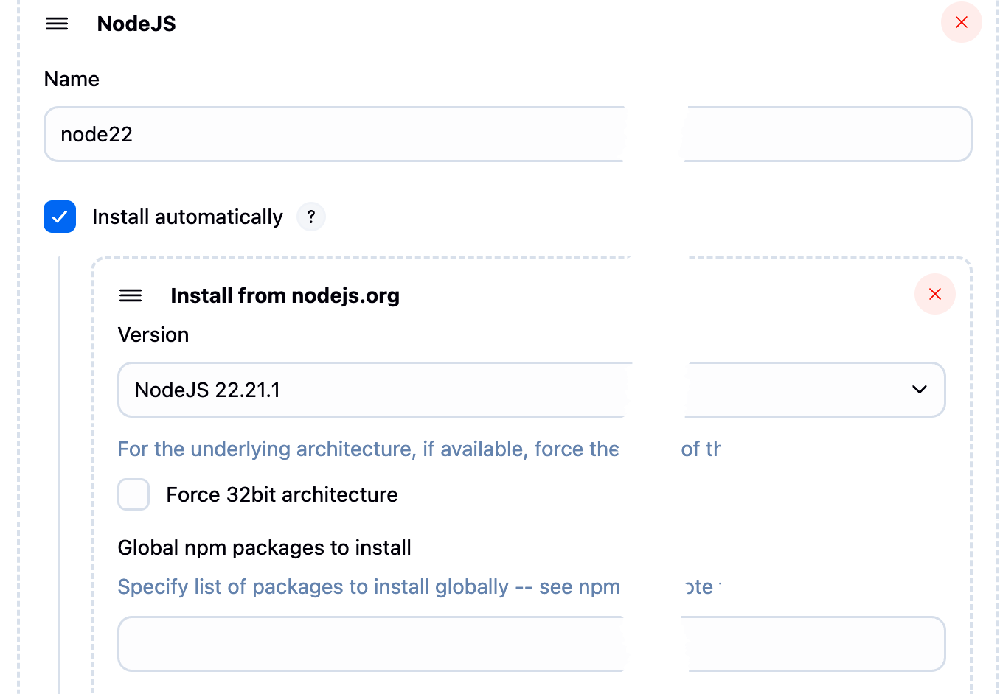
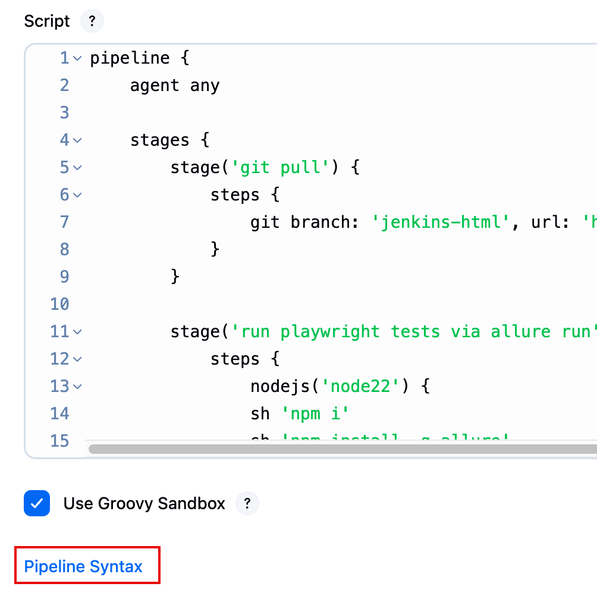

# Diciembre 2025

## 2025-12-14

Acabo de ver la película Mar adentro, cuenta la historia de un hombre que siempre quiso morir. Bueno, claro, no siempre, pero supongo que para una persona que a los veinte con tantos años perdió la capacidad de moverse, los siguientes 20 años serán ese "siempre" que recuerda.

Esta película es una cuestión sobre si una persona puede disponer de su vida como quiera, incluyendo temas como si debe seguir vivo o no, teniendo en cuenta que la vida es un derecho de cada persona, pero no su obligación.

Si una persona no quiere vivir, ¿tiene derecho la sociedad a negarle su deseo de morir, si lo que tiene no le trae ninguna alegría y lo único en lo que puede pensar es en la muerte? Al final muere, pero lo hace según sus palabras "como un criminal".

## 2025-12-18

### Allure 3 can be added as HTML report to Jenkins pipeline without dedicated plugin

::: info
T&C apply ;)
:::

#### What we need

1. Jenkins
2. Jenkins pipeline
3. Some tests
4. Some plug-ins.
   1. Install [HTML publisher](https://plugins.jenkins.io/htmlpublisher/)
   2. Install [NodeJs plug-in](https://plugins.jenkins.io/nodejs/), Allure3 will need it anyway.

#### Add node to your Jenkins

In the Jenkins configuration section go to Tools and find NodeJS (`/manage/configureTools/`).

I chose version 22 and haven't regretted it.

#### Setup pipeline for using node and running tests

1. Go to the pipeline
2. Click Pipeline syntax
   1. I surprised a lot of people don't know about this link.
   2. 

