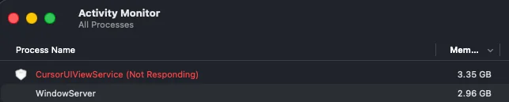

# abril 2026

## CursorUIViewService is not responding and eats RAM

CursorUIViewService is a macOS system process responsible for rendering the input cursor and the keyboard layout switch indicator. A memory leak issue first appeared in macOS Sonoma and continues to occur in Sequoia.

Some report the killing of the process leads to MacOS crash, some don't. In my case the issue was quite quick transition to "not responding" state and gradual increase of RAM consumption from 8 Mbytes which is okay for such process up to 4.6 Gbytes which is just silly.

This only has a temporary effect and the state gets back to a not very desired one quite soon. Based from what I've read, some experiencing even MacOS lags due to this behaviour.



Ultimately, I've decided to disable the process, and I have no regrets.

Disable the pisoshet.

```shell
sudo defaults write /Library/Preferences/FeatureFlags/Domain/UIKit.plist redesigned_text_cursor -dict-add Enabled -bool NO
```

There is another way teh internet says:

```shell
sudo launchctl disable gui/501/com.apple.CursorUIViewService
sudo launchctl bootout gui/501/com.apple.CursorUIViewService
```

**501** above is the standard user ID of the first MacOS user, which can be checked via `id -u`.

Then reboot and that's it.
